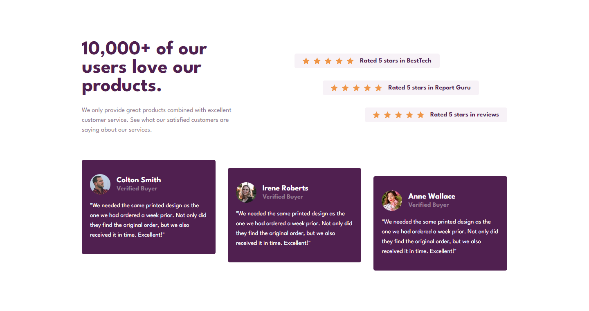

# Frontend Mentor - Social proof section solution

This is a solution to the [Social proof section challenge on Frontend Mentor](https://www.frontendmentor.io/challenges/social-proof-section-6e0qTv_bA). Frontend Mentor challenges help you improve your coding skills by building realistic projects. 

## Table of contents

- [Overview](#overview)
  - [The challenge](#the-challenge)
  - [Screenshot](#screenshot)
  - [Links](#links)
- [My process](#my-process)
  - [Built with](#built-with)
  - [What I learned](#what-i-learned)
- [Author](#author)

## Overview

### The challenge

Users should be able to:

- View the optimal layout for the section depending on their device's screen size

### Screenshot

### Links

- Solution URL: [Here](https://github.com/Senatauro/1-social-proof-section)
- Live Site URL: [Here](https://62d199af4624d44d5c154123--gregarious-speculoos-3c4f31.netlify.app/)

## My process

### Built with

- Semantic HTML5 markup
- CSS custom properties
- Flexbox
- Mobile-first workflow
- [React](https://reactjs.org/) - JS library

### What I learned

There was some time that I didnt used React or HTML/CSS/JS, so I took a little longer that I should have to. This challenge is easy to make, not much to talk about here.

### Continued development

For my continued development I need to keep doing challenges with React, coding projects with HTML and CSS and it would be good to start learning a styling framework like Bootstrap or Tailwind CSS.

Right now I'm starting with the AWS Amplify Studio UI to make Figma components into react components (not used in this challenge). AWS Amplify is really cool

## Author

- Github - [@Senatauro](https://github.com/Senatauro)
- Frontend Mentor - [@Senatauro](https://www.frontendmentor.io/profile/senatauro)